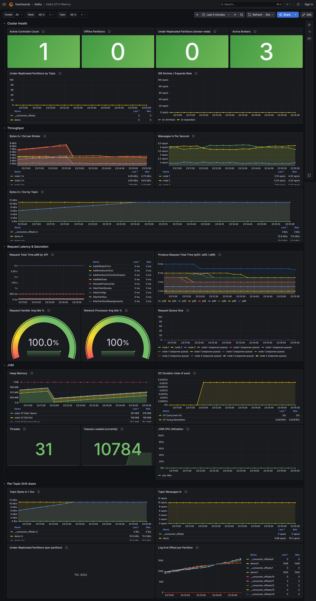
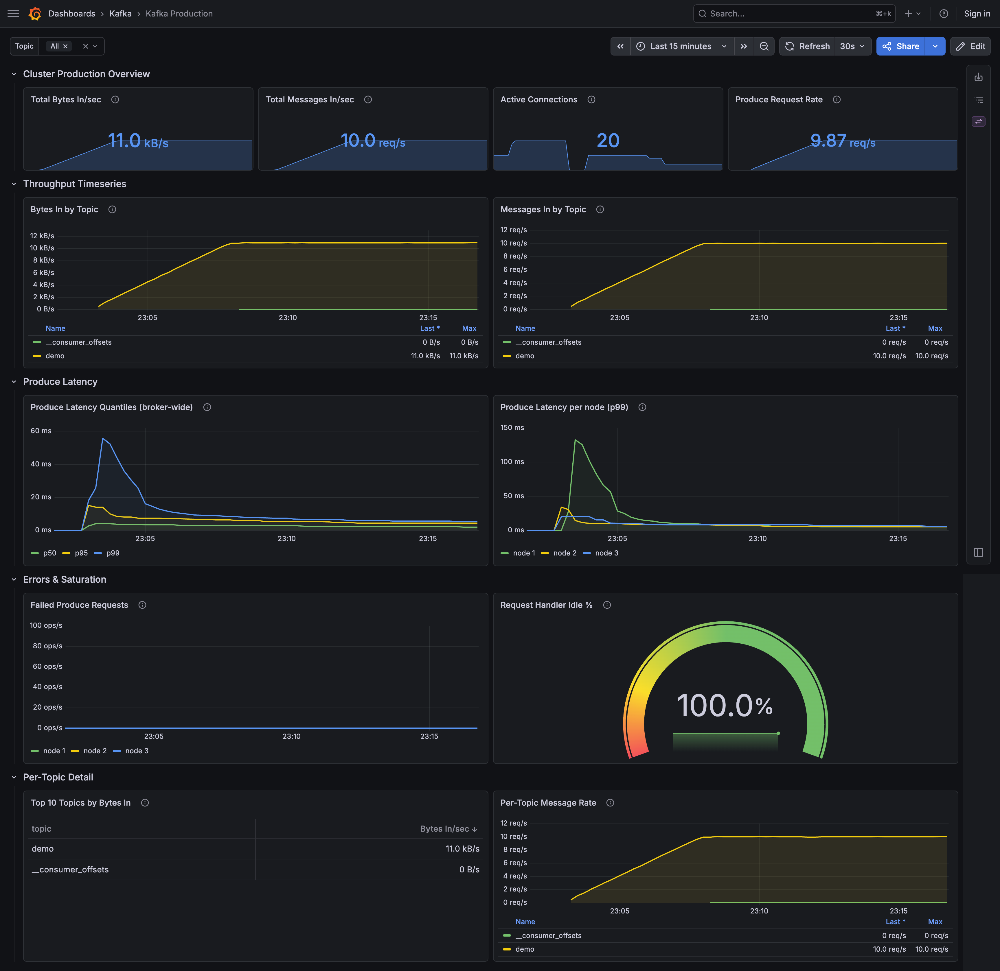
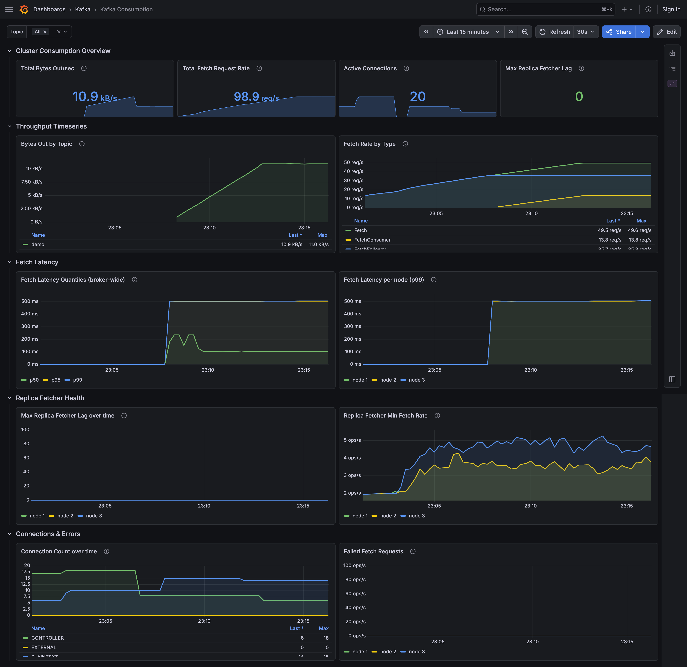
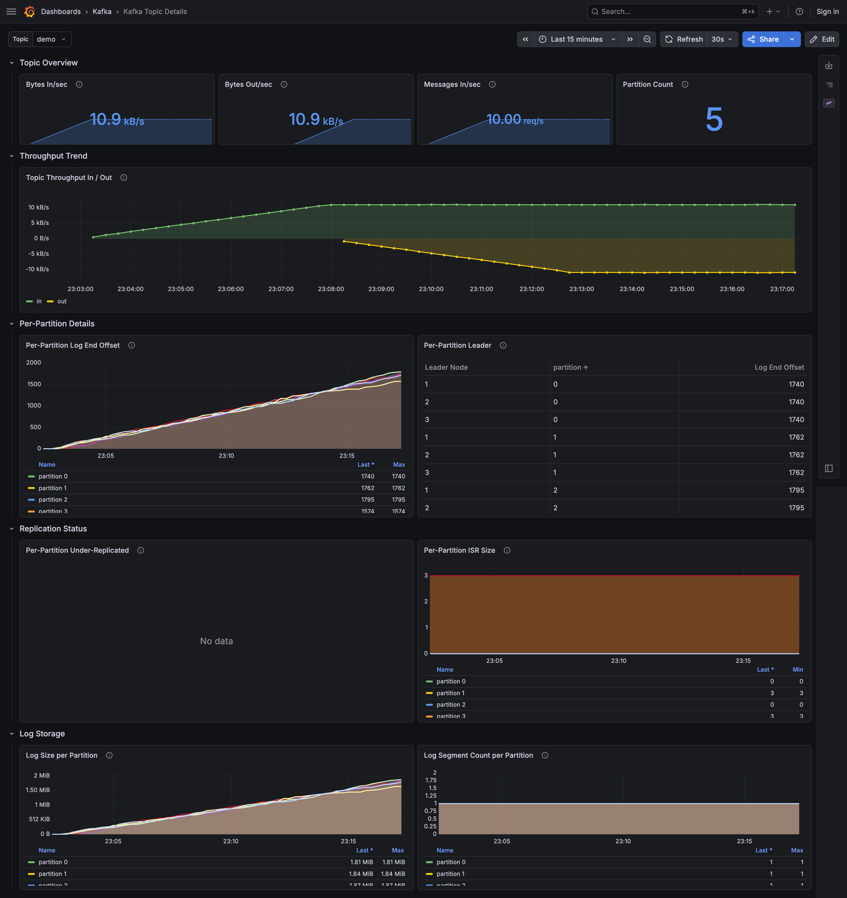
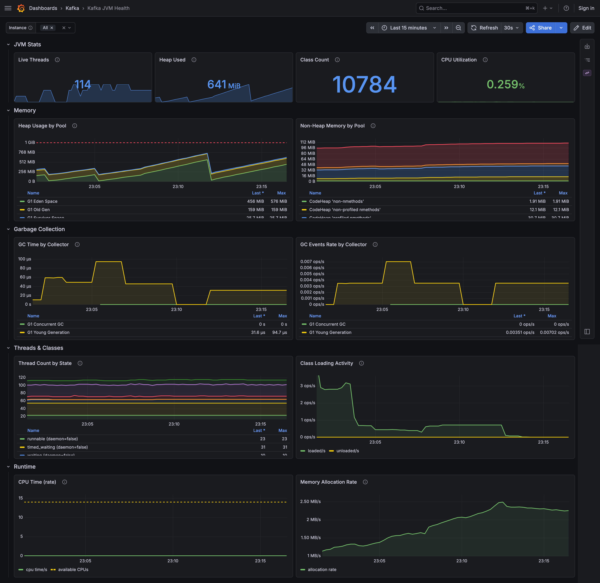

# monedula-metrics-reporter

[](https://github.com/monedula-dev/monedula-metrics-reporter/actions/workflows/ci.yml?query=branch%3Amain)
[](https://github.com/monedula-dev/monedula-metrics-reporter/security/code-scanning)
[](https://www.gnu.org/licenses/agpl-3.0)
[](https://adoptium.net/)
[](https://kafka.apache.org/)

A Kafka `MetricsReporter` plugin that exports metrics natively over OTLP (gRPC or HTTP) to an OpenTelemetry collector. Fully async, configurable, fail-safe — Kafka operations are never blocked regardless of collector availability.

## Why this plugin?

- **Native OTLP, no JMX hop.** Most Kafka observability stacks bolt on `jmx_exporter` (or similar) as a JVM agent, then scrape MBeans over an HTTP endpoint, then push to a collector. This plugin lives inside the Kafka process and speaks OTLP directly to the collector — one fewer process, one fewer config surface, and no JMX rule YAMLs to maintain.
- **One plugin, both Kafka registries.** Kafka brokers expose metrics through *two* parallel systems: the Kafka SPI (`metric.reporters`) and the legacy Yammer/Coda Hale registry. Several broker-internal signals (`UnderReplicatedPartitions`, `OfflinePartitionsCount`, `ActiveControllerCount`, the per-topic `BrokerTopicMetrics`) only register with Yammer. `OtlpMetricReporter` attaches to both with a single configuration. The same JAR runs unchanged on clients, where the Yammer side auto-disables.
- **Fail-safe by design — Kafka is never blocked.** Metric callbacks (`metricChange`, `metricRemoval`) only touch an in-memory `ConcurrentHashMap`; all I/O happens on a daemon scheduler thread. If the collector is unreachable, the export call times out, the batch is dropped, the next tick starts fresh. No retry queue, no unbounded memory, no impact on Kafka produce/fetch latency.
- **Broker context becomes first-class Prometheus labels.** Kafka invokes `MetricsReporter.contextChange(MetricsContext)` with cluster id, node/broker id, and Kafka version. The plugin captures those and attaches them as OTLP resource attributes — they surface as labels (`kafka_cluster_id`, `kafka_node_id` / `kafka_broker_id`) on every series, so `by(kafka_cluster_id, kafka_node_id)` works in PromQL with zero extra wiring.

## Alternatives

If this plugin doesn't fit your stack, here's how it compares to the common alternatives:

| Approach | What it is | When to pick it instead |
|---|---|---|
| [`jmx_exporter`](https://github.com/prometheus/jmx_exporter) (Prometheus) | JVM agent that exposes Kafka MBeans on an HTTP `/metrics` endpoint | You're Prometheus-only and don't need multi-backend OTLP routing; you're already comfortable maintaining the JMX-to-Prometheus rule YAMLs |
| OTel Collector [`jmxreceiver`](https://github.com/open-telemetry/opentelemetry-collector-contrib/tree/main/receiver/jmxreceiver) | Pulls JMX MBeans over the network from outside the broker | You can't add JARs to brokers (e.g. a managed Kafka without plugin support); willing to enable JMX-remote with auth |
| [`kafka-exporter`](https://github.com/danielqsj/kafka_exporter) | Sidecar that uses the Kafka Admin API for consumer-group lag and partition state | You only need a thin slice (lag, offsets, ISR) and don't care about broker internals or client-side metrics |
| Confluent `telemetry-reporter` | Confluent's proprietary reporter pushing to Confluent's metrics service | You're on Confluent Cloud / Confluent Platform under their management |
| Strimzi + `jmx_exporter` sidecar | Strimzi's default observability path (jmx_exporter pre-wired) | You're in a Strimzi-managed K8s deployment and don't want to introduce a non-Strimzi component |

**Pick this plugin when:** you want OTLP-native export with no scrape endpoints to manage, both Kafka registries (SPI + Yammer) covered by one configuration, broker context as labels for free, and a fail-safe collection path that can't stall the broker.

For the longer product and engineering rationale, see:

- [Architecture](docs/architecture.md)
- [Architectural assumptions](docs/assumptions.md)

## Requirements

- Java 17+
- Apache Kafka 3.x or 4.x (broker or client)
- An OTLP collector endpoint

## Compatibility

CI builds the shadow JAR and runs the full unit + integration suite against the
full Cartesian product of the JDK and Kafka versions below:

| | Kafka 3.7.0 | Kafka 3.9.0 | Kafka 4.2.0 | Kafka 4.3.0 |
|---|:---:|:---:|:---:|:---:|
| **JDK 17** | ✓ | ✓ | ✓ | ✓ |
| **JDK 21** | ✓ | ✓ | ✓ | ✓ |

The end-to-end test (Kafka + OTel collector + Prometheus via Testcontainers)
runs once per CI build against the default Kafka version (`4.2.0`) — the
contact surface with Kafka is already covered by the matrix above, so
multiplying e2e by every cell would add runtime without adding coverage.

## Installation

```bash
# Build the shadow JAR
./gradlew shadowJar

# Copy into Kafka's libs/ directory (or anywhere on Kafka's classpath)
cp build/libs/monedula-metrics-reporter-0.1.0.jar $KAFKA_HOME/libs/
```

Then add to `server.properties` (broker) or producer/consumer config:

```properties
# One reporter, both metric streams. On brokers it covers Kafka SPI *and* Yammer
# registries; on clients only the SPI registry is present and the Yammer side
# auto-disables.
metric.reporters=dev.monedula.metricsreporter.OtlpMetricReporter

otlp.metric.reporter.endpoint=http://otel-collector:4317
otlp.metric.reporter.transport=grpc
```

Kafka brokers expose metrics through **two parallel systems**: the Kafka SPI (`metric.reporters`) and the legacy Yammer/Coda Hale registry. Most client-facing metrics live in the SPI registry, but several broker-internal signals — most notably `UnderReplicatedPartitions`, `OfflinePartitionsCount`, `ActiveControllerCount`, and the per-topic `BrokerTopicMetrics` — are only registered in the Yammer registry. `OtlpMetricReporter` hooks into both: it implements Kafka's `MetricsReporter` interface and, when it detects it's running inside a broker JVM (probed reflectively via `org.apache.kafka.server.metrics.KafkaYammerMetrics`), it also attaches a listener to the Yammer registry. The same JAR works unchanged on clients — the Yammer attach simply no-ops.

### Broker context as resource labels

When loaded inside a broker, Kafka invokes `MetricsReporter.contextChange(MetricsContext)` with the cluster id, node/broker id, and Kafka version. `OtlpMetricReporter` captures those and attaches them to every exported metric as OTLP **resource attributes** — they appear as Prometheus labels on every series:

```
kafka_controller_kafkacontroller_activecontrollercount{
  kafka_cluster_id="...", kafka_node_id="1"
} 1
```

The exact set of keys depends on the broker deployment mode: KRaft brokers emit `kafka.node.id`, ZooKeeper-mode brokers emit `kafka.broker.id`. After OTel/Prometheus dotted-key sanitization the labels are `kafka_node_id` / `kafka_broker_id` respectively. User-supplied `otlp.metric.reporter.resource.attributes` are merged on top and win on key conflicts. The `_namespace` context entry is **not** emitted as a resource attribute — it is encoded as the metric-name prefix instead (see below).

For Resource attributes to surface as Prometheus labels (rather than be dropped) the OTel collector's `prometheus` exporter needs `resource_to_telemetry_conversion: { enabled: true }` — see [quickstart/otel-collector-config.yaml](quickstart/otel-collector-config.yaml).

### Collector → Prometheus is pull-based (preserves metric type metadata)

The quickstart stack wires Prometheus to **scrape** the collector's `/metrics` endpoint on port `8889` (via the `prometheus` exporter), rather than have the collector push via `prometheusremotewrite`. This preserves the `# TYPE` and `# HELP` comments end-to-end, so Prometheus's metric explorer and `/api/v1/metadata` report `gauge` / `counter` / `histogram` instead of `unknown`. The OTel collector's PRW 1.x metadata path is unreliable and PRW 2.0 is still marked "in development" in the exporter (as of collector `v0.152`), so pull-based scraping is the robust choice today.

If your deployment topology can't allow Prometheus to reach the collector directly (firewall, sidecar setup, ...), swap the `prometheus` exporter back for `prometheusremotewrite`, but be aware that metric types will likely appear as `unknown`.

### Per-topic and per-partition labels

For Yammer metrics the label set comes from Yammer's `scope` string, which Kafka encodes as `key.value.key.value...`. The mapper splits the scope pairwise into attributes. Notable per-topic / per-partition examples:

```
# Per-topic (scope="topic.<name>")
kafka_server_brokertopicmetrics_bytesinpersec{topic="my-topic"}

# Per-partition (scope="topic.<name>.partition.<n>")
kafka_cluster_partition_underreplicated{topic="my-topic", partition="0"}
```

Note that `kafka_server_replicamanager_underreplicatedpartitions` is the **broker-wide aggregate** (no `topic`/`partition` labels), while `kafka_cluster_partition_underreplicated{topic,partition}` is the **per-partition** variant. Use the aggregate for broker health, the per-partition gauge to localize which partition is degraded.

### Sample metric names

Once the reporter is running on broker + clients, the following metric names (among many others) will appear in Prometheus:

```
# Broker-side (Kafka SPI — broker's internal clients & request handlers)
kafka_server_producer_metrics_record_send_rate
kafka_server_consumer_fetch_manager_metrics_records_consumed_rate
kafka_server_request_metrics_requestspersec

# Broker-side Yammer
kafka_controller_kafkacontroller_activecontrollercount
kafka_controller_kafkacontroller_offlinepartitionscount
kafka_server_replicamanager_underreplicatedpartitions
kafka_server_brokertopicmetrics_bytesinpersec
kafka_cluster_partition_underreplicated

# JVM runtime (memory, GC, threads, classes, CPU)
jvm_thread_count
jvm_memory_used_bytes
jvm_gc_duration_seconds
jvm_cpu_time_seconds_total

# Reporter self-monitoring
monedula_reporter_export_success_total
monedula_reporter_export_failure_total
monedula_reporter_export_duration_ms
```

JVM metrics are emitted on the same OTLP pipeline and carry the same resource labels (`kafka_cluster_id`, `kafka_node_id` / `kafka_broker_id`) as the Kafka metrics, so they're trivially joinable with broker-side series in Prometheus/PromQL. They're sourced from OpenTelemetry's `opentelemetry-runtime-telemetry-java17` instrumentation library (JMX MXBeans + JFR streaming on Java 17+). If JFR cannot start in the host JVM, the reporter falls back to JMX-only runtime metrics instead of disabling the whole JVM metrics pipeline.

### Reporter self-monitoring

The reporter emits three metrics describing its own health on every export tick, so a broken collector pipeline shows up as more than just absent Kafka metrics:

| Metric | Type | Meaning |
|---|---|---|
| `monedula_reporter_export_success_total` | counter | Cumulative successful OTLP exports since the reporter started (cumulative; use PromQL `rate()` for per-second rate). |
| `monedula_reporter_export_failure_total` | counter | Cumulative failed exports (timeout, refused, mapping error). Same cumulative semantics. |
| `monedula_reporter_export_duration_ms` | gauge | Wall-clock duration of the **previous** tick in milliseconds. Spikes here indicate a slow collector. |

Counters are cumulative since the reporter started — they grow monotonically and never reset within a JVM lifetime, so always use `rate()` / `increase()` over them in PromQL, never the raw value. Each reporter instance gets a unique `service.instance.id` resource label (auto-generated UUID), so two reporter instances in the same JVM stay distinguishable; operators can override with a deterministic value via `otlp.metric.reporter.resource.attributes=service.instance.id=...`.

Suggested alert (see [`quickstart/prometheus-alerts.yml`](quickstart/prometheus-alerts.yml) for a working example):

```promql
rate(monedula_reporter_export_failure_total[5m]) > 0
```

The `kafka_server_` prefix on SPI metrics comes from the `_namespace` value Kafka places into the `MetricsContext` on the broker. When this plugin is loaded into a standalone producer or consumer client JVM (not a broker), the prefix automatically becomes `kafka_producer_` or `kafka_consumer_` respectively — Kafka sets the namespace per process role.

## Configuration

All keys use the prefix `otlp.metric.reporter.`.

| Key | Type | Default | Description |
|-----|------|---------|-------------|
| `otlp.metric.reporter.endpoint` | String | `http://localhost:4317` | OTLP collector endpoint. For `grpc`, use the collector gRPC endpoint such as `http://collector:4317`. For `http`, a bare collector root such as `http://collector:4318` is normalized to `http://collector:4318/v1/metrics`; custom paths are used as provided |
| `otlp.metric.reporter.transport` | Enum | `grpc` | `grpc` or `http` |
| `otlp.metric.reporter.interval.ms` | Long | `30000` | Export interval in milliseconds |
| `otlp.metric.reporter.timeout.ms` | Long | `5000` | Per-export call timeout in milliseconds |
| `otlp.metric.reporter.allowed.metrics` | List | `""` | Comma-separated regex patterns used for allow-listing metrics. SPI metrics are matched against `{group}.{name}`; Yammer metrics are matched against `{group}.{type}.{name}`. Empty = allow all; an invalid pattern is logged at ERROR and the reporter runs as no-op so Kafka stays up |
| `otlp.metric.reporter.resource.attributes` | String | `""` | Extra OTLP resource attributes: `key=value,key=value` |
| `otlp.metric.reporter.headers` | String | `""` | Static OTLP request headers as `Header-Name=value,Other=value`. Use this for collector auth such as bearer tokens or API keys. Header values may contain `=`, but commas are treated as separators |
| `otlp.metric.reporter.compression` | Enum | `none` | OTLP exporter compression: `none` or `gzip` |
| `otlp.metric.reporter.trusted.certificates.path` | String | `""` | Optional path to a PEM CA bundle used to trust the collector TLS certificate |
| `otlp.metric.reporter.client.certificate.path` | String | `""` | Optional path to a PEM client certificate for mTLS. Must be configured together with `otlp.metric.reporter.client.key.path` |
| `otlp.metric.reporter.client.key.path` | String | `""` | Optional path to a PEM client private key for mTLS. Must be configured together with `otlp.metric.reporter.client.certificate.path` |
| `otlp.metric.reporter.jvm.metrics.enabled` | Boolean | `true` | Whether to also export JVM runtime metrics via OpenTelemetry's runtime instrumentation library. Disable if you scrape JVM metrics elsewhere. |

For TLS with the platform default trust store, use an `https://` OTLP endpoint. Configure `trusted.certificates.path` when the collector uses a private CA, and configure both client TLS paths when the collector requires mutual TLS. If any of these static settings are malformed or unreadable, the reporter logs the startup failure and runs as no-op so Kafka remains available.

> **Security note.** Header values such as bearer tokens land in `server.properties` (or whichever Kafka config file you use) in plain text and are readable by anyone with file-system access to that file. Use Kafka's environment-variable config form (`KAFKA_OTLP_METRIC_REPORTER_HEADERS=...`) or a secrets-aware deployment system if you need to keep the token out of files on disk.

Anything beyond the reporter-level controls above — credential rotation, HTTP/SOCKS proxy chains, fan-out to multiple backends, vendor-specific OTLP exporters (Grafana Cloud, Honeycomb, Datadog, …), batching/retry policy — lives in the OpenTelemetry Collector, not in this plugin. See the upstream [Collector configuration docs](https://opentelemetry.io/docs/collector/configuration/) for those operational concerns. The reporter's settings rotate via JVM restart only (see [docs/assumptions.md](docs/assumptions.md#operational-assumptions)).

Metric names are emitted as flat lowercase `{namespace}_{group}_{name}` (Strimzi-style): non-alphanumeric characters become underscores, consecutive underscores collapse, and leading/trailing underscores are stripped. The `{namespace}` segment is sourced from `MetricsContext._namespace` (e.g. `kafka.server` on a broker, `kafka.producer` / `kafka.consumer` on clients). Example: broker-side `producer-metrics` / `record-send-rate` becomes `kafka_server_producer_metrics_record_send_rate`. If no namespace is present in the context, the prefix is omitted (`producer_metrics_record_send_rate`).

## Quickstart

A complete demo stack — Kafka (KRaft, 3-broker cluster), the OTel collector, Prometheus, and Grafana — ships under [`quickstart/`](quickstart). Bring it up to see the plugin running end-to-end before you wire it into your own cluster. Three brokers in combined broker/controller mode means `__consumer_offsets`, the transaction log, and any topic created with default replication factor come up healthy — closer to what a real deployment looks like.

### Start the stack

```bash
./gradlew shadowJar
cd quickstart
docker compose up -d
```

Give the containers ~45 seconds to come up. The compose file mounts the freshly-built shadow JAR into each of the three broker containers, so every broker boots with the plugin already loaded and starts pushing metrics to the collector on the first tick. The brokers are reachable from the host as `localhost:9092`, `localhost:9094`, and `localhost:9096` if you want to point your own producer or `kafka-console-producer` at the cluster.

### Open Grafana

Visit [http://localhost:3000](http://localhost:3000) (anonymous access enabled — no login). Five dashboards are auto-provisioned into the **Kafka** folder:

| Dashboard | UID | Use it for |
|-----------|-----|------------|
| Kafka OTLP Metrics | [`kafka-otlp`](http://localhost:3000/d/kafka-otlp) | Overview: cluster health, throughput, latency, JVM, per-topic drill-down |
| Kafka Production | [`kafka-otlp-production`](http://localhost:3000/d/kafka-otlp-production) | Producer-side: ingest throughput, Produce latency, failed Produce requests |
| Kafka Consumption | [`kafka-otlp-consumption`](http://localhost:3000/d/kafka-otlp-consumption) | Consumer-side: outbound throughput, Fetch latency, replica-fetcher lag |
| Kafka Topic Details | [`kafka-otlp-topic-details`](http://localhost:3000/d/kafka-otlp-topic-details) | Per-topic drill-down: throughput, per-partition log end offset, leaders, ISR |
| Kafka JVM Health | [`kafka-otlp-jvm`](http://localhost:3000/d/kafka-otlp-jvm) | JVM runtime: heap, GC, threads, class loading, CPU |

### Start at the overview

**Kafka OTLP Metrics** is the front door. It's organised into five rows so you can scan top-down: cluster health first, then throughput, then where latency is going, then the JVM, then anything topic-specific.



1. **Cluster Health** — active controller, offline partitions, broker-wide under-replicated partitions, active broker count, per-topic under-replication and ISR shrink/expand rate.
2. **Throughput** — bytes in / out and messages in per broker, plus a per-topic byte-rate breakdown.
3. **Request Latency & Saturation** — `totaltimems` p99 per API, Produce p50/p95/p99, request-handler and network-processor idle ratios, request/response queue depth.
4. **JVM** — heap (used by pool, committed, limit), GC time fraction by collector, live threads, loaded classes, CPU utilisation ratio.
5. **Per-Topic Drill-down** — per-topic bytes & messages, per-partition under-replication table, per-partition log end offset (gated by the `$topic` template variable).

The `$cluster_id`, `$node_id`, and `$topic` variables at the top of the page filter every panel at once — set them to scope the entire overview to a single cluster, broker, or topic.

### Drill into produce / consume

When a Produce-side incident is in progress, switch to **Kafka Production** for the dedicated producer view — quantile latency, failed Produce requests, and request-handler saturation alongside the top topics by bytes in.



The mirror view for the read path is **Kafka Consumption**: outbound throughput, Fetch latency quantiles, replica-fetcher lag, connection counts, and failed Fetch requests.



### Investigate a specific topic

Pick a topic from the `$topic` variable on **Kafka Topic Details** to see in/out throughput, per-partition log-end offset, leader placement, ISR size, under-replication, on-disk size, and segment count — all scoped to that one topic.



### Check the JVM

The plugin also exports JVM runtime metrics via OpenTelemetry's `opentelemetry-runtime-telemetry-java17`, so the broker's heap, GC, threads, class loading, CPU, and allocation rate land on the same OTLP pipeline and carry the same broker-context labels. **Kafka JVM Health** is the dedicated view.



### Drop down to Prometheus

Prometheus is live on [http://localhost:9090](http://localhost:9090) if you want to write ad-hoc PromQL or confirm metric-type metadata flows end-to-end (e.g. `curl localhost:9090/api/v1/metadata?metric=kafka_controller_kafkacontroller_activecontrollercount` should report `"type":"gauge"`, not `"unknown"`).

### Stop the stack

```bash
docker compose down
```

## Building from source

```bash
git clone <repo-url>
cd monedula-metrics-reporter
./gradlew shadowJar
# Output: build/libs/monedula-metrics-reporter-0.1.0.jar
```

## Testing

```bash
# Unit and integration tests (integration tests require Docker)
./gradlew test

# End-to-end test (full stack with Kafka, requires Docker, takes ~30s)
./gradlew :e2e:test
```

## How it works

Kafka calls `metricChange()` synchronously when a metric is added or updated. The plugin stores the metric in a `ConcurrentHashMap` (after applying any allow-list regex filter) — no I/O on the calling thread. A daemon scheduler thread periodically snapshots the registry, maps each metric to an OTel gauge `MetricData`, and exports the batch to the collector. If the collector is unreachable, the export call fails silently after its timeout, the batch is dropped, and the next tick starts fresh — no retry queue, no memory growth, no impact on Kafka.

## License

Licensed under the [GNU Affero General Public License v3.0](LICENSE) (AGPL-3.0).
