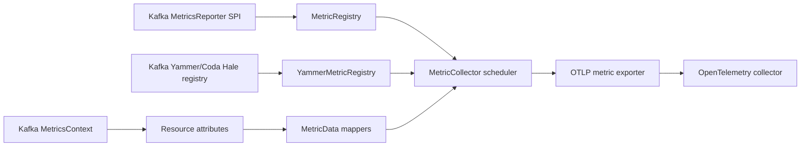

# Architecture

`monedula-metrics-reporter` is a Kafka `MetricsReporter` implementation that
exports Kafka metrics to an OpenTelemetry collector over OTLP. The architecture
is deliberately small: capture metrics synchronously, export asynchronously,
and keep Kafka's request/produce/fetch path independent from collector health.

## Data Flow

## Components

- `OtlpMetricReporter` is the Kafka entry point. It owns configuration,
  lifecycle, Kafka context labels, the SPI registry, the optional Yammer
  registry, and the optional JVM metrics pipeline.
- `OtlpMetricReporterConfig` parses and validates reporter settings under the
  `otlp.metric.reporter.` prefix.
- `MetricRegistry` stores allow-listed Kafka SPI metrics in a concurrent map
  and returns numeric, finite values during snapshot.
- `YammerMetricRegistry` attaches to Kafka's Yammer registry when broker classes
  are present and stores allow-listed broker-internal metrics.
- `MetricDataMapper` converts Kafka SPI metrics to OpenTelemetry gauge
  `MetricData`.
- `YammerMetricDataMapper` converts Yammer gauges, counters, meters, timers,
  and histograms to OpenTelemetry metric data.
- `MetricCollector` runs a single daemon scheduler thread that snapshots both
  registries and exports each batch.
- `OtlpExporterFactory` creates the gRPC or HTTP OTLP exporter.
- `ResourceFactory` constructs the shared OpenTelemetry resource so Kafka,
  Yammer, and JVM metrics can carry the same identity labels.

## Core Design Choices

Metric callbacks are intentionally cheap. `metricChange`, `metricRemoval`, and
`init` update only in-memory state. The collector performs mapping and network
I/O later on a daemon thread.

The exporter has no retry queue. If the collector is unavailable or an export
times out, the current batch is dropped. The next scheduled export snapshots
the latest values and tries again.

OTLP exporter options are intentionally static at reporter startup. The
reporter supports request headers for collector authentication, gzip
compression, custom trusted certificates, and client certificate/key files for
mTLS. If those files are missing or malformed, the same fail-open startup rule
applies: log the configuration problem and run as no-op rather than blocking
Kafka startup.

The Yammer bridge is optional. Broker JVMs should expose broker-internal
metrics through Kafka's Yammer registry, while client JVMs should still run with
only the Kafka SPI metrics available.

Kafka context labels are treated as resource attributes, not data-point labels.
That keeps broker identity consistent across Kafka SPI metrics, Yammer metrics,
and JVM runtime metrics.

JVM runtime metrics prefer the full Java 17 runtime instrumentation path, which
includes JMX MXBeans and JFR streaming. If JFR cannot start in the host JVM, the
reporter retries with JMX-only runtime metrics so memory, thread, class, and
other MXBean-backed signals can still be exported.

Metric names are flattened to Prometheus-friendly lowercase names. Kafka's
namespace, group, type, and metric name are encoded into a single stable metric
name, while Kafka tags and parsed Yammer scopes become labels.

## Current Boundaries

The reporter is not a consumer lag exporter. Consumer lag, offset age, and
Admin API based topic inventory are better handled by tools such as
`kafka_exporter` or a dedicated companion component.

The reporter is not a collector replacement. It can authenticate to a
collector, but fan-out, remote write, vendor export, batching, retry policy,
credential rotation, and backend-specific routing belong in the OpenTelemetry
collector.

The reporter does not expose a Prometheus scrape endpoint. Prometheus support
comes from the collector's Prometheus exporter.
